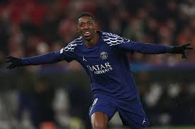
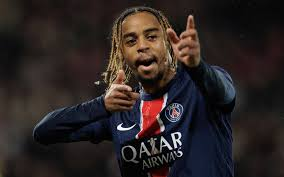
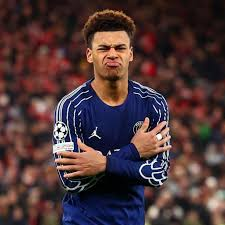

<!DOCTYPE html>
<html lang="fr">
<head>
  <meta charset="UTF-8">
  <meta http-equiv="X-UA-Compatible" content="IE=edge">
  <meta name="viewport" content="width=device-width, initial-scale=1.0">
  <link rel="stylesheet" href="style.css">
  <title>Titre de la page</title>
</head>
<body>
  <html>
<body>

  

<h1>Le trio offensif du PSG en 2025</h1>

En 2025, le Paris Saint-Germain est un club très important du football européen.
L’équipe cherche à jouer un football offensif et spectaculaire.
Pour cela, le trio offensif est essentiel dans le jeu.
Ces trois joueurs attaquent, marquent des buts et créent des occasions.
Ils travaillent ensemble pour aider l’équipe à gagner les matchs.
Leur rôle est très important tout au long de la saison.

Ousmane Dembélé est un joueur connu pour sa grande vitesse.
Il est très fort en dribble et aime provoquer les défenseurs.
Il joue souvent sur les côtés du terrain.
Grâce à son expérience, il aide l’équipe dans les moments difficiles.
Il participe beaucoup au jeu offensif et fait souvent des passes décisives.
Il est un élément important du PSG en 2025.

Bradley Barcola est un joueur jeune et très dynamique.
Il court beaucoup et fait de nombreux appels.
Il aime attaquer rapidement et se projeter vers le but.
Il progresse match après match et gagne de la confiance.
Il marque des buts importants et aide son équipe à avancer.
En 2025, il devient un joueur de plus en plus important pour le PSG.

Désiré Doué est un jeune talent très prometteur.
Il est technique, rapide et créatif avec le ballon.
Il n’a pas peur de tenter des dribbles ou des frappes.
Il apporte de la fraîcheur et de nouvelles idées dans le jeu.
Son intelligence de jeu aide beaucoup l’équipe.
Il représente l’avenir du Paris Saint-Germain.

Le trio offensif du PSG en 2025 fonctionne très bien ensemble.
Les joueurs se comprennent et se complètent.
Ils mettent beaucoup de pression sur les défenses adverses.
Grâce à eux, le PSG peut contrôler les matchs et marquer des buts.
Ce trio est un élément clé du succès de l’équipe.

<a href="new 2.html">Aller à la deuxième page</a>

</body>
</html>
